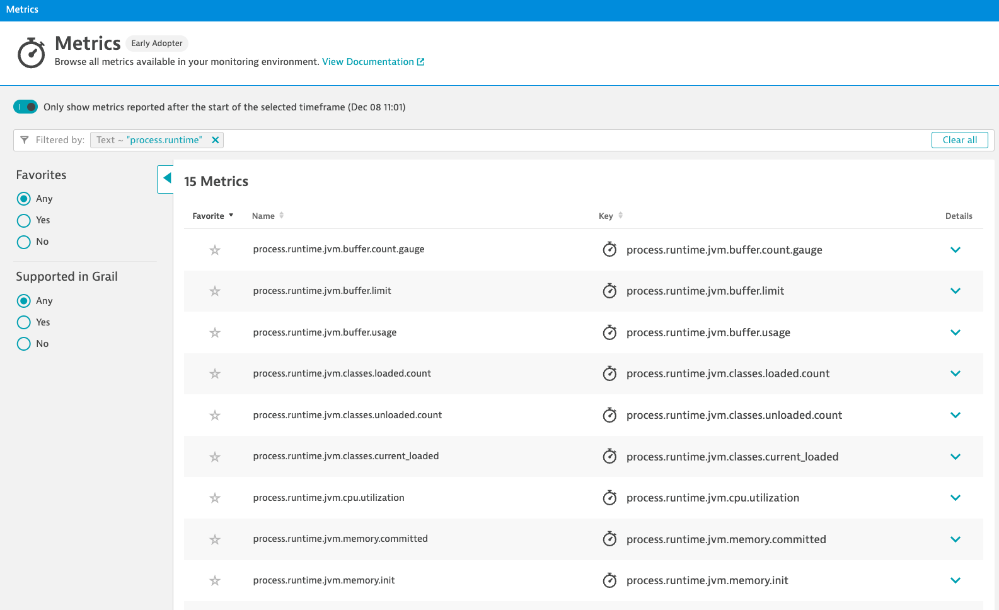

## OpenTelemetry metric definition in Java

In this section we create a new OpenTelemetry instrument and setup the logic to pass a measurement. 

Reference: Dynatrace documentation
- [Dynatrace OpenTelemetry Metrics](https://docs.dynatrace.com/docs/shortlink/otel-overview-metrics)
- [Dynatrace OpenTelemetry instrument code samples](https://docs.dynatrace.com/docs/shortlink/opentelemetry-instrument-examples)
- [Dynatrace OpenTelemetry Metrics Limitations](https://docs.dynatrace.com/docs/shortlink/opentelemetry-metrics-limitations)
- [Java: Supported libraries, frameworks, application servers, and JVMs](https://github.com/open-telemetry/opentelemetry-java-instrumentation/blob/main/docs/supported-libraries.md#supported-libraries-frameworks-application-servers-and-jvms)

---

### 📌 Task #1: Create an additional instrument

**Your Task:** Create an addtional LongCounter to track attempted Purchases

**1.1** In the file `src/main/shop/FrontendServer.java` on line 38 create a new LongCounter object called `expectedPurchaseCounter` (similar to line 34,35,36) with the following properties:
- name:`"shop.purhcases.expected"`
- description:`"Number of expected purchases"`

<details>
  <summary>Expand to copy and paste the code</summary>

  ```java
private static final LongCounter attemptedPurchasesCounter = meter.counterBuilder("shop." + environment + ".purchases.attempted").setDescription("Attempted number of purchases").build();
  ```
</details>

---

### 📌 Task #2: Pass a measurment 

**Your Task:** Call the newly created function in the code to pass a measurment

**2.1** In the file `src/main/shop/FrontendServer.java` after line 89 create a new function called `reportExpectedPurchases`, taking `product` as a parameter, and adding 1 to our expectedPurchases `instrument`.

Hint: this will be almost exactly the same as the `reportPurchases` function starting on line 76. 

<details>
  <summary>Expand to copy and paste the code</summary>

  ```java
	private static void reportAttemptedPurchases(Product product) {
		Attributes attributes = Attributes.of(AttributeKey.stringKey("product"), product.getName());
		attemptedPurchasesCounter.add(1, attributes);
	}
  ```
</details>

**2.2** Between line 54 and 55 call the `reportExpectedPurchases` function passing `product` as an argument. 

Hint: this will be almost exactly the same as the call to `reportExpectedRevenue` on line 54. 

<details>
  <summary>Expand to copy and paste the code</summary>

  ```java
		reportAttemptedPurchases(product);
  ```
</details>

Then restart your applicaiton:


<gif of restarting application >

**2.3** Open the Data Explorer and search metrics by the name you've set as your ENVIRONMENT variable in the begining of the Hot Session. Be aware it may take a couple minutes for your new metric to appear.


As part of the OpenTelemetrey auto-isntrumentation some metrics are provided out of the box depending on the libraries and technologies being used. To find out if the framework you plan to use has metrics included in auto-insturmentation look at the github here:

[Java: Supported libraries, frameworks, application servers, and JVMs](https://github.com/open-telemetry/opentelemetry-java-instrumentation/blob/main/docs/supported-libraries.md#supported-libraries-frameworks-application-servers-and-jvms)

To see the metrics that are provided out of the box in our usecase naviate to the Metric Explorer and search for `process.runtime`. 



---

