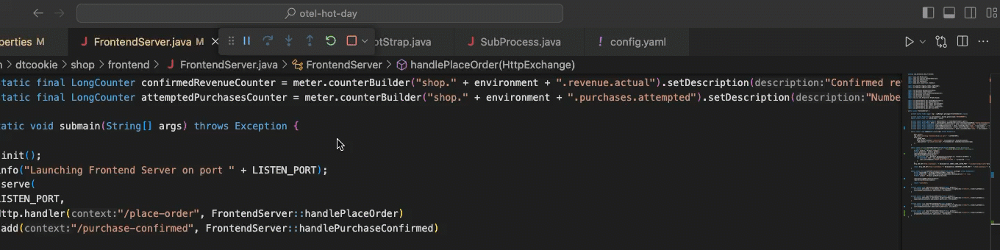

## OpenTelemetry metric definition in Java

In this section we create a new OpenTelemetry instrument and setup the logic to pass a measurement. 

Reference: Dynatrace documentation
- [Dynatrace OpenTelemetry Metrics](https://docs.dynatrace.com/docs/shortlink/otel-overview-metrics)
- [Dynatrace OpenTelemetry instrument code samples](https://docs.dynatrace.com/docs/shortlink/opentelemetry-instrument-examples)
- [Dynatrace OpenTelemetry Metrics Limitations](https://docs.dynatrace.com/docs/shortlink/opentelemetry-metrics-limitations)
- [Java: Supported libraries, frameworks, application servers, and JVMs](https://github.com/open-telemetry/opentelemetry-java-instrumentation/blob/main/docs/supported-libraries.md#supported-libraries-frameworks-application-servers-and-jvms)


### 📌 Task #1: Create an additional instrument

**Your Task:** Create an addtional LongCounter to track attempted Purchases

In the file `src/main/shop/FrontendServer.java` on line 47 create a new LongCounter object called `expectedPurchaseCounter` (similar to line 43,44,45) with the following properties:
- name:`shop.purchases.expected`
- description:`Number of expected purchases`

<details>
  <summary>Expand to copy and paste the code</summary>

  ```java
private static final LongCounter attemptedPurchasesCounter = meter.counterBuilder("shop.purchases.attempted").setDescription("Attempted number of purchases").build();
  ```
</details>

### 📌 Task #2: Function to pass a measurement 

**Your Task:** Create a function that will pass a measurement to your instrument 

In the file `src/main/shop/FrontendServer.java` after line 152 create a new function called `reportAttemptedPurchases`, taking `product` as a parameter, and adding 1 to our expectedPurchases `instrument`.

Hint: this will be almost exactly the same as the `reportPurchases` function starting on line 139. 

<details>
  <summary>Expand to copy and paste the code</summary>

  ```java
	private static void reportAttemptedPurchases(Product product) {
		Attributes attributes = Attributes.of(AttributeKey.stringKey("product"), product.getName());
		attemptedPurchasesCounter.add(1, attributes);
	}
  ```
</details>


### 📌 Task #3: Passing a measurment 

Between line 64 and 65 call the `reportAttemptedPurchases` function passing `product` as an argument. 

Hint: this will be almost exactly the same as the call to `reportExpectedRevenue` on line 64. 

<details>
  <summary>Expand to copy and paste the code</summary>

```java
reportAttemptedPurchases(product);
```
Seen inline:
  ```diff
	public static String handlePlaceOrder(HttpExchange exchange) throws Exception {
		// log.info("Placing order");
		Product product = Product.random();
		String productID = product.getID();
		reportExpectedRevenue(product);
+	reportAttemptedPurchases(product);
		try (Connection con = Database.getConnection(10, TimeUnit.SECONDS)) {
			try (Statement stmt = con.createStatement()) {
				stmt.executeUpdate("INSERT INTO orders VALUES (" + productID + ")");
			}
		}
		validateCreditCard(product);
		return checkInventory(product);
	}
  ```
</details>

Then restart your applicaiton:



<gif of restarting application >

### 📌 Task #4: Finding your metric

Open the Data Explorer and search `Text:` for `shop` to find the custom metrics. Be aware it may take a couple minutes for your new metric to appear.


As part of the OpenTelemetrey auto-isntrumentation some metrics are provided out of the box depending on the libraries and technologies being used. To find out if the framework you plan to use has metrics included in auto-insturmentation look at the github here:

[Java: Supported libraries, frameworks, application servers, and JVMs](https://github.com/open-telemetry/opentelemetry-java-instrumentation/blob/main/docs/supported-libraries.md#supported-libraries-frameworks-application-servers-and-jvms)

To see the metrics that are provided out of the box by opentelemetry search `process.runtime`. 


---

