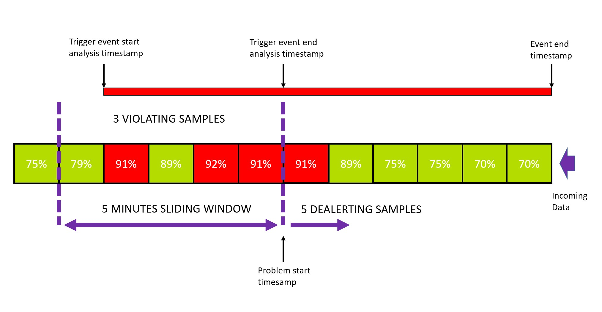

## Metric Events (Alerting)

#### 📌 Task

Lets create an Auto Adaptive baseline metric event for the `shop.<NAME>.database.connections.active` metric. 

Navigate to `Settings` > `Anomoly detection` > `Metric Events` > `Add Metric Event`

Set the following:

| Field | Value |
| ------ | ------------- |
| Summary | `Shop: Connections Active`  |
| Type | `Metric Selector` |
| Metric selector | `shop.<NAME>.database.connections.active:splitBy():sort(value(auto,descending)):limit(20)` |

Set the following in the `Monitoring strategy` section:

| Field | Value |
| ------ | ------------- |
| Model Type | `Static threshold`  |
| Number of signal fluctuations | `28` |
| Alert condition | `Alert if metric is above` | 

Then in Alert Preview:

| Field | Value |
| ------ | ------------- |
| Dimension values | `Dimensionless metric`  |

This should trigger a preview based on past data where alerts would have triggered with your current settings.

If you find it too sensitive play with the settings labeled `Advanced model properties` to adjust the alerting, dealerting, and sample period. 

