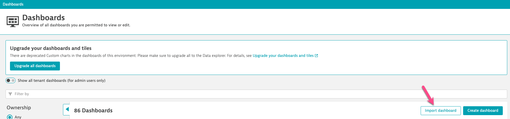

## Metric Visualization & Analysis

Now that we have our metrics in Dynatrace we need to create a business & observability dashboard. 

---

## Dashboarding

#### 📌 1 - Upload `Daily Sales - Business Dashbaord`

Copy the following JSON to a file and save it as `Shop Business Health.json`. 

<details>
  <summary>Expand for dashboard JSON</summary>

```JSON
{
  "metadata": {
    "configurationVersions": [
      7
    ],
    "clusterVersion": "1.283.84.20240122-091713"
  },
  "id": "f00f09cc-eb57-4f83-ac3f-068078558e4d",
  "dashboardMetadata": {
    "name": "Shop Business Health",
    "shared": false,
    "owner": "ryan.shaw@dynatrace.com",
    "hasConsistentColors": false
  },
  "tiles": [
    {
      "name": "Service Health",
      "tileType": "HEADER",
      "configured": true,
      "bounds": {
        "top": 874,
        "left": 0,
        "width": 342,
        "height": 38
      },
      "tileFilter": {},
      "isAutoRefreshDisabled": false
    },
    {
      "name": "Business Health",
      "tileType": "HEADER",
      "configured": true,
      "bounds": {
        "top": 0,
        "left": 0,
        "width": 304,
        "height": 38
      },
      "tileFilter": {},
      "isAutoRefreshDisabled": false
    },
    {
      "name": "Database Active Connections",
      "tileType": "DATA_EXPLORER",
      "configured": true,
      "bounds": {
        "top": 912,
        "left": 1140,
        "width": 570,
        "height": 342
      },
      "tileFilter": {},
      "isAutoRefreshDisabled": false,
      "customName": "Data explorer results",
      "queries": [
        {
          "id": "A",
          "metric": "shop.database.connections.active",
          "spaceAggregation": "AUTO",
          "timeAggregation": "DEFAULT",
          "splitBy": [],
          "sortBy": "DESC",
          "sortByDimension": "",
          "filterBy": {
            "nestedFilters": [],
            "criteria": []
          },
          "limit": 20,
          "rate": "NONE",
          "enabled": true
        }
      ],
      "visualConfig": {
        "type": "STACKED_AREA",
        "global": {},
        "rules": [
          {
            "matcher": "A:",
            "unitTransform": "auto",
            "valueFormat": "auto",
            "properties": {
              "color": "GRAY",
              "seriesType": "STACKED_AREA",
              "alias": "Active Connections"
            },
            "seriesOverrides": []
          }
        ],
        "axes": {
          "xAxis": {
            "displayName": "",
            "visible": true
          },
          "yAxes": [
            {
              "displayName": "",
              "visible": true,
              "min": "AUTO",
              "max": "AUTO",
              "position": "LEFT",
              "queryIds": [
                "A"
              ],
              "defaultAxis": true
            }
          ]
        },
        "heatmapSettings": {
          "yAxis": "VALUE"
        },
        "thresholds": [
          {
            "axisTarget": "LEFT",
            "rules": [
              {
                "color": "#7dc540"
              },
              {
                "color": "#f5d30f"
              },
              {
                "color": "#dc172a"
              }
            ],
            "visible": true
          }
        ],
        "tableSettings": {
          "hiddenColumns": []
        },
        "graphChartSettings": {
          "connectNulls": false
        },
        "honeycombSettings": {
          "showHive": true,
          "showLegend": true,
          "showLabels": false
        }
      },
      "queriesSettings": {
        "resolution": ""
      },
      "metricExpressions": [
        "resolution=null&(shop.database.connections.active:splitBy():sort(value(auto,descending)):limit(20)):limit(100):names"
      ]
    },
    {
      "name": "Number of Purchases",
      "tileType": "DATA_EXPLORER",
      "configured": true,
      "bounds": {
        "top": 38,
        "left": 570,
        "width": 570,
        "height": 380
      },
      "tileFilter": {},
      "isAutoRefreshDisabled": false,
      "customName": "Data explorer results",
      "queries": [
        {
          "id": "A",
          "spaceAggregation": "AUTO",
          "timeAggregation": "DEFAULT",
          "splitBy": [],
          "metricSelector": "shop.purchases.confirmed.count:splitBy():sort(value(auto,descending)):limit(20)",
          "rate": "NONE",
          "enabled": true
        }
      ],
      "visualConfig": {
        "type": "SINGLE_VALUE",
        "global": {},
        "rules": [
          {
            "matcher": "A:",
            "properties": {
              "color": "DEFAULT"
            },
            "seriesOverrides": []
          }
        ],
        "axes": {
          "xAxis": {
            "visible": true
          },
          "yAxes": []
        },
        "heatmapSettings": {
          "yAxis": "VALUE"
        },
        "singleValueSettings": {
          "showTrend": true,
          "showSparkLine": true,
          "linkTileColorToThreshold": true
        },
        "thresholds": [
          {
            "axisTarget": "LEFT",
            "rules": [
              {
                "value": 0,
                "color": "#14a8f5"
              },
              {
                "color": "#f5d30f"
              },
              {
                "color": "#dc172a"
              }
            ],
            "queryId": "",
            "visible": true
          }
        ],
        "tableSettings": {
          "hiddenColumns": []
        },
        "graphChartSettings": {
          "connectNulls": false
        },
        "honeycombSettings": {
          "showHive": true,
          "showLegend": true,
          "showLabels": false
        }
      },
      "queriesSettings": {
        "resolution": ""
      },
      "metricExpressions": [
        "resolution=Inf&(shop.purchases.confirmed.count:splitBy():sort(value(auto,descending)):limit(20)):limit(100):names",
        "resolution=null&(shop.purchases.confirmed.count:splitBy():sort(value(auto,descending)):limit(20))"
      ]
    },
    {
      "name": "Average $ Per Purchase",
      "tileType": "DATA_EXPLORER",
      "configured": true,
      "bounds": {
        "top": 38,
        "left": 1140,
        "width": 570,
        "height": 380
      },
      "tileFilter": {},
      "isAutoRefreshDisabled": false,
      "customName": "Data explorer results",
      "queries": [
        {
          "id": "C",
          "spaceAggregation": "AUTO",
          "timeAggregation": "DEFAULT",
          "splitBy": [],
          "metricSelector": "shop.revenue.actual.count:splitBy():sort(value(auto,descending)):limit(20) / shop.purchases.confirmed.count:splitBy():sort(value(auto,descending)):limit(20)",
          "rate": "NONE",
          "enabled": true
        }
      ],
      "visualConfig": {
        "type": "SINGLE_VALUE",
        "global": {},
        "rules": [
          {
            "matcher": "C:",
            "properties": {
              "color": "DEFAULT"
            },
            "seriesOverrides": []
          }
        ],
        "axes": {
          "xAxis": {
            "visible": true
          },
          "yAxes": []
        },
        "heatmapSettings": {
          "yAxis": "VALUE"
        },
        "singleValueSettings": {
          "showTrend": true,
          "showSparkLine": true,
          "linkTileColorToThreshold": true
        },
        "thresholds": [
          {
            "axisTarget": "LEFT",
            "rules": [
              {
                "value": 0,
                "color": "#9cd575"
              },
              {
                "color": "#f5d30f"
              },
              {
                "color": "#dc172a"
              }
            ],
            "queryId": "",
            "visible": true
          }
        ],
        "tableSettings": {
          "hiddenColumns": []
        },
        "graphChartSettings": {
          "connectNulls": false
        },
        "honeycombSettings": {
          "showHive": true,
          "showLegend": true,
          "showLabels": false
        }
      },
      "queriesSettings": {
        "resolution": ""
      },
      "metricExpressions": [
        "resolution=Inf&(shop.revenue.actual.count:splitBy():sort(value(auto,descending)):limit(20)/shop.purchases.confirmed.count:splitBy():sort(value(auto,descending)):limit(20)):limit(100):names",
        "resolution=null&(shop.revenue.actual.count:splitBy():sort(value(auto,descending)):limit(20)/shop.purchases.confirmed.count:splitBy():sort(value(auto,descending)):limit(20))"
      ]
    },
    {
      "name": "Top Product by Sales",
      "tileType": "DATA_EXPLORER",
      "configured": true,
      "bounds": {
        "top": 456,
        "left": 0,
        "width": 570,
        "height": 380
      },
      "tileFilter": {},
      "isAutoRefreshDisabled": false,
      "customName": "Data explorer results",
      "queries": [
        {
          "id": "A",
          "spaceAggregation": "AUTO",
          "timeAggregation": "DEFAULT",
          "splitBy": [
            "product"
          ],
          "metricSelector": "shop.purchases.confirmed.count:splitBy(product):sort(value(auto,descending)):limit(20)",
          "rate": "NONE",
          "enabled": true
        }
      ],
      "visualConfig": {
        "type": "TOP_LIST",
        "global": {},
        "rules": [
          {
            "matcher": "A:",
            "properties": {
              "color": "DEFAULT"
            },
            "seriesOverrides": []
          }
        ],
        "axes": {
          "xAxis": {
            "visible": true
          },
          "yAxes": []
        },
        "heatmapSettings": {
          "yAxis": "VALUE"
        },
        "thresholds": [
          {
            "axisTarget": "LEFT",
            "rules": [
              {
                "color": "#7dc540"
              },
              {
                "color": "#f5d30f"
              },
              {
                "color": "#dc172a"
              }
            ],
            "visible": true
          }
        ],
        "tableSettings": {
          "hiddenColumns": []
        },
        "graphChartSettings": {
          "connectNulls": false
        },
        "honeycombSettings": {
          "showHive": true,
          "showLegend": true,
          "showLabels": false
        }
      },
      "queriesSettings": {
        "resolution": ""
      },
      "metricExpressions": [
        "resolution=Inf&(shop.purchases.confirmed.count:splitBy(product):sort(value(auto,descending)):limit(20)):limit(100):names"
      ]
    },
    {
      "name": "Revenue - Expected v Actual",
      "tileType": "DATA_EXPLORER",
      "configured": true,
      "bounds": {
        "top": 456,
        "left": 570,
        "width": 570,
        "height": 380
      },
      "tileFilter": {},
      "isAutoRefreshDisabled": false,
      "customName": "Data explorer results",
      "queries": [
        {
          "id": "A",
          "spaceAggregation": "AUTO",
          "timeAggregation": "DEFAULT",
          "splitBy": [],
          "metricSelector": "shop.revenue.actual.count:splitBy():sort(value(auto,descending)):limit(20)",
          "rate": "NONE",
          "enabled": true
        },
        {
          "id": "B",
          "spaceAggregation": "AUTO",
          "timeAggregation": "DEFAULT",
          "splitBy": [],
          "metricSelector": "shop.revenue.expected.count:splitBy():sort(value(auto,descending)):limit(20)",
          "rate": "NONE",
          "enabled": true
        }
      ],
      "visualConfig": {
        "type": "GRAPH_CHART",
        "global": {},
        "rules": [
          {
            "matcher": "A:",
            "unitTransform": "auto",
            "valueFormat": "auto",
            "properties": {
              "color": "RED",
              "seriesType": "LINE",
              "alias": "Actual Revenue"
            },
            "seriesOverrides": []
          },
          {
            "matcher": "B:",
            "unitTransform": "auto",
            "valueFormat": "auto",
            "properties": {
              "color": "GREEN",
              "seriesType": "LINE",
              "alias": "Expected Revenue"
            },
            "seriesOverrides": []
          }
        ],
        "axes": {
          "xAxis": {
            "displayName": "",
            "visible": true
          },
          "yAxes": [
            {
              "displayName": "",
              "visible": true,
              "min": "AUTO",
              "max": "AUTO",
              "position": "LEFT",
              "queryIds": [
                "A",
                "B"
              ],
              "defaultAxis": true
            }
          ]
        },
        "heatmapSettings": {
          "yAxis": "VALUE"
        },
        "thresholds": [
          {
            "axisTarget": "LEFT",
            "rules": [
              {
                "color": "#7dc540"
              },
              {
                "color": "#f5d30f"
              },
              {
                "color": "#dc172a"
              }
            ],
            "visible": true
          }
        ],
        "tableSettings": {
          "hiddenColumns": []
        },
        "graphChartSettings": {
          "connectNulls": false
        },
        "honeycombSettings": {
          "showHive": true,
          "showLegend": true,
          "showLabels": false
        }
      },
      "queriesSettings": {
        "resolution": ""
      },
      "metricExpressions": [
        "resolution=null&(shop.revenue.actual.count:splitBy():sort(value(auto,descending)):limit(20)):limit(100):names,(shop.revenue.expected.count:splitBy():sort(value(auto,descending)):limit(20)):limit(100):names"
      ]
    },
    {
      "name": "Lost Revenue (due to error)",
      "tileType": "DATA_EXPLORER",
      "configured": true,
      "bounds": {
        "top": 456,
        "left": 1140,
        "width": 570,
        "height": 380
      },
      "tileFilter": {},
      "isAutoRefreshDisabled": false,
      "customName": "Data explorer results",
      "queries": [
        {
          "id": "A",
          "spaceAggregation": "AUTO",
          "timeAggregation": "DEFAULT",
          "splitBy": [],
          "metricSelector": "shop.revenue.expected.count:splitBy():sort(value(auto,descending)):limit(20) - shop.revenue.actual.count:splitBy():sort(value(auto,descending)):limit(20)",
          "rate": "NONE",
          "enabled": true
        }
      ],
      "visualConfig": {
        "type": "SINGLE_VALUE",
        "global": {},
        "rules": [
          {
            "matcher": "A:",
            "properties": {
              "color": "DEFAULT"
            },
            "seriesOverrides": []
          }
        ],
        "axes": {
          "xAxis": {
            "visible": true
          },
          "yAxes": []
        },
        "heatmapSettings": {
          "yAxis": "VALUE"
        },
        "singleValueSettings": {
          "showTrend": true,
          "showSparkLine": true,
          "linkTileColorToThreshold": true
        },
        "thresholds": [
          {
            "axisTarget": "LEFT",
            "rules": [
              {
                "color": "#7dc540"
              },
              {
                "color": "#f5d30f"
              },
              {
                "value": 0,
                "color": "#dc172a"
              }
            ],
            "queryId": "",
            "visible": true
          }
        ],
        "tableSettings": {
          "hiddenColumns": []
        },
        "graphChartSettings": {
          "connectNulls": false
        },
        "honeycombSettings": {
          "showHive": true,
          "showLegend": true,
          "showLabels": false
        }
      },
      "queriesSettings": {
        "resolution": ""
      },
      "metricExpressions": [
        "resolution=Inf&(shop.revenue.expected.count:splitBy():sort(value(auto,descending)):limit(20)-shop.revenue.actual.count:splitBy():sort(value(auto,descending)):limit(20)):limit(100):names",
        "resolution=null&(shop.revenue.expected.count:splitBy():sort(value(auto,descending)):limit(20)-shop.revenue.actual.count:splitBy():sort(value(auto,descending)):limit(20))"
      ]
    },
    {
      "name": "Total Sales Revenue",
      "tileType": "DATA_EXPLORER",
      "configured": true,
      "bounds": {
        "top": 38,
        "left": 0,
        "width": 570,
        "height": 380
      },
      "tileFilter": {},
      "isAutoRefreshDisabled": false,
      "customName": "Total Revenue",
      "queries": [],
      "visualConfig": {
        "type": "SINGLE_VALUE",
        "global": {},
        "rules": [],
        "axes": {
          "xAxis": {
            "visible": true
          },
          "yAxes": []
        },
        "thresholds": []
      },
      "metricExpressions": []
    },
    {
      "name": "Backend Error Rate",
      "tileType": "DATA_EXPLORER",
      "configured": true,
      "bounds": {
        "top": 912,
        "left": 570,
        "width": 570,
        "height": 342
      },
      "tileFilter": {},
      "isAutoRefreshDisabled": false
    },
    {
      "name": "Backend Response Time",
      "tileType": "DATA_EXPLORER",
      "configured": true,
      "bounds": {
        "top": 912,
        "left": 0,
        "width": 570,
        "height": 342
      },
      "tileFilter": {},
      "isAutoRefreshDisabled": false,
      "customName": "Data explorer results",
      "queries": [
        {
          "id": "A",
          "metric": "builtin:service.request.response_time_service_aggregation",
          "spaceAggregation": "AUTO",
          "timeAggregation": "DEFAULT",
          "splitBy": [],
          "sortBy": "DESC",
          "sortByDimension": "",
          "filterBy": {
            "filterOperator": "AND",
            "nestedFilters": [
              {
                "filter": "dt.entity.service",
                "filterType": "NAME",
                "filterOperator": "OR",
                "entityAttribute": "entityName",
                "nestedFilters": [],
                "criteria": [
                  {
                    "value": "order-backend",
                    "evaluator": "IN",
                    "matchExactly": true
                  }
                ]
              }
            ],
            "criteria": []
          },
          "limit": 20,
          "rate": "NONE",
          "enabled": true
        }
      ],
      "visualConfig": {
        "type": "GRAPH_CHART",
        "global": {},
        "rules": [
          {
            "matcher": "A:",
            "properties": {
              "color": "DEFAULT"
            },
            "seriesOverrides": []
          }
        ],
        "axes": {
          "xAxis": {
            "displayName": "",
            "visible": true
          },
          "yAxes": [
            {
              "displayName": "",
              "visible": true,
              "min": "AUTO",
              "max": "AUTO",
              "position": "LEFT",
              "queryIds": [
                "A"
              ],
              "defaultAxis": true
            }
          ]
        },
        "heatmapSettings": {
          "yAxis": "VALUE"
        },
        "thresholds": [
          {
            "axisTarget": "LEFT",
            "rules": [
              {
                "color": "#7dc540"
              },
              {
                "color": "#f5d30f"
              },
              {
                "color": "#dc172a"
              }
            ],
            "visible": true
          }
        ],
        "tableSettings": {
          "hiddenColumns": []
        },
        "graphChartSettings": {
          "connectNulls": false
        },
        "honeycombSettings": {
          "showHive": true,
          "showLegend": true,
          "showLabels": false
        }
      },
      "queriesSettings": {
        "resolution": ""
      },
      "metricExpressions": [
        "resolution=null&(builtin:service.request.response_time_service_aggregation:filter(and(or(in(\"dt.entity.service\",entitySelector(\"type(service),entityName.equals(~\"order-backend~\")\"))))):splitBy():sort(value(auto,descending)):limit(20)):limit(100):names"
      ]
    }
  ]
}
```
</details>

Once saved upload the dashboard to your tenant - open `Dashboards Classic` and `Import Dashboard`



#### 📌 2 - Modify the Business Health tile

Modify the business tiles so that they use your specific metrics. 

For `Total Sales Revenue`:
1. Click the tile
1. Click `Configure in Data Explorer`
1. Paste your metric `shop.revenue.actual.count`
1. Click `↻ Run Query`
1. Set the Green threshold to `0` in the right settings column
1. Click `Save Changes to Dashboard`

Repeate these steps for the other tiles (not expected to finsih this task)

#### 📌 3 - Modify the Service Health tiles [1 or more]

Modify the service tiles so that they use your specific metrics. 

For `Backend Failure Count`:
1. Click the tile
1. Click `Configure in Data Explorer`
1. Select the metric `Unified service failure count`
1. Change the Filter to your service `Service` > `Name` > `order-backend`
1. Click `↻ Run Query`
1. Set the color to Red in the right settings column
1. Click `Save Changes to Dashboard`

#### 📌 4 - Add a line graph tile to display the response time of the `/quote` endpoint

1. Drag a graph tile into the dashboard.
1. Click the tile and select `Configure tile in Data Explorer`
2. Select the `Unified service request response time (by service, endpoint)`
1. Split by `Endpoint`
1. Filter by `Endpoint` > `/quote`
1. Click `↻ Run Query`
1. Save changes to dashboard
1. Rename the tile to `Response Time: /quote`