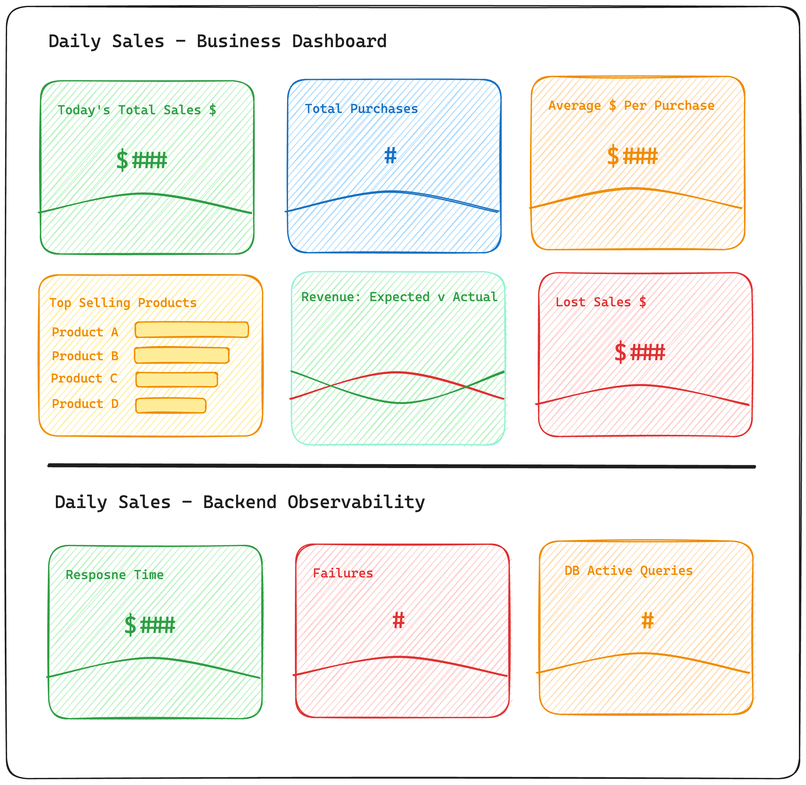

## Metric Visualization & Analysis

Now that we have our metrics in Dynatrace we need to create a business & observability dashboard. 

---

## Dashboarding

#### 📌 1 - Clone `Daily Sales - Business Dashbaord`

Open `Daily Sales - Business Dashbaord` from Dashboards and clone it, we'll modify this to fit your specific metrics.

#### 📌 2 - Modify the Business tiles

Modify the business tiles so that they use your specific metrics. 

<to-do>

#### 📌 3 - Modify the Observability tiles

Modify the observability tiles so that they use your specific metrics. 

<to-do>