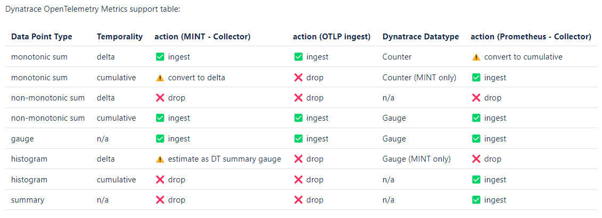
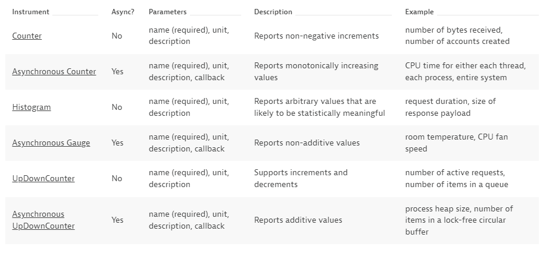
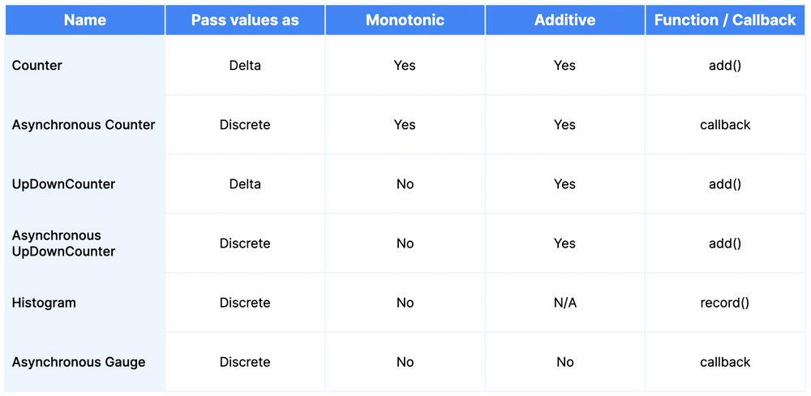
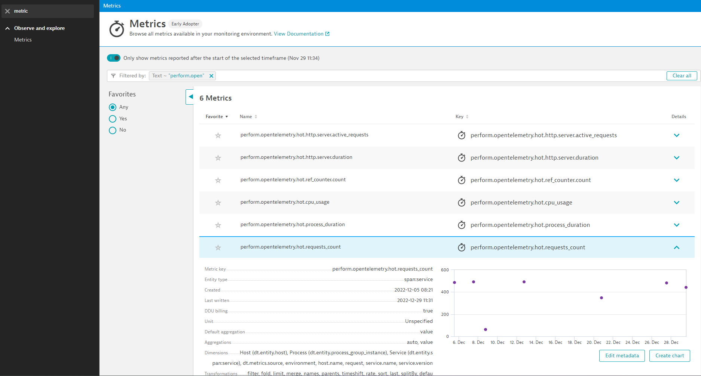
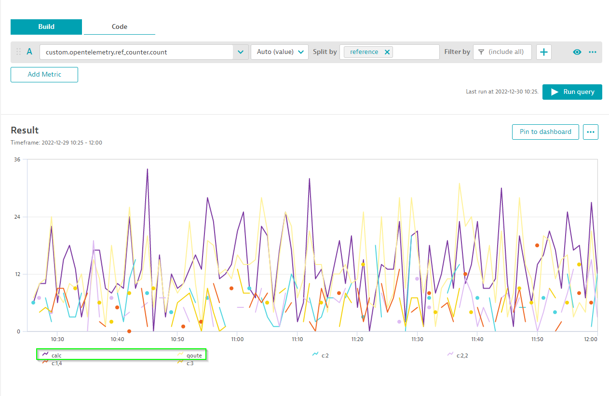

# Creating python metrics

In addition to traces, Open Telemetry allows for metrics collection

Goal: collect a synchronous response time metric

### 1.  OpenTelemetery Metrics Concepts

Reference: Dynatrace documentation
- [OpenTelemetry metric concepts](https://www.dynatrace.com/support/help/shortlink/opentelemetry-metric-concepts)
- [OpenTelemetry instrument code samples](https://www.dynatrace.com/support/help/shortlink/opentelemetry-instrument-examples)

1. OpenTelemetry metric concepts
1. MeterProvider & MetricReader/Exporter configuration
1. Instrument definition
1. Recording a measurement (sync & async)
1. Task: Create a histogram metric

# 1. OpenTelemetry Metric Concepts

The Metrics API consists of these main components:

`MeterProvider`: The MeterProvider is responsible for creating Meter instances and is expected to be the stateful object that holds our configuration

`Meter`: is the class responsible for creating Instruments and it does not hold any configuration. 

`Instrument`: is responsible for reporting Measurements. Each Instrument will have the following fields:
- The name of the Instrument
- The kind of the Instrument - whether it is a Counter or one of the other kinds, whether it is synchronous or asynchronous
- An optional unit of measure
- An optional description

Here is an example of the object hierarchy inside a process instrumented with the metrics API:

```java
+-- MeterProvider(default)
    |
    +-- Meter(name='io.opentelemetry.runtime', version='1.0.0')
    |   |
    |   +-- Instrument<Asynchronous Gauge, int>(name='cpython.gc', attributes=['generation'], unit='kB')
    |   |
    |   +-- instruments...
    |
    +-- Meter(name='io.opentelemetry.contrib.mongodb.client', version='2.3.0')
        |
        +-- Instrument<Counter, int>(name='client.exception', attributes=['type'], unit='1')
        |
        +-- Instrument<Histogram, double>(name='client.duration', attributes=['net.peer.host', 'net.peer.port'], unit='ms')
        |
        +-- instruments...

+-- MeterProvider(custom)
    |
    +-- Meter(name='perform-hot', version='1.0.0')
        |
        +-- instruments...
```

# 2. Meter Provider Configuration 

Navigate to the following file:

```
pysrvc/otel.py
```

On line `94` we initalize everything by creating the global variable `ot` which will hold the configuration for our global MeterProvider:

```python
ot = CustomOpenTelemetry()
```

On line `22` where we find our `CustomOpenTelemetry()` class and the initalization function on line `23` - we'll go through this line by line for a better understanding:

```python
    def __init__(self):
            self.resource_props = self.get_resource_props()
            self.setup_exporters()
            self.metrics = {}
            self.tracer = trace.get_tracer("perform-hot")
            self.meter = metrics.get_meter("perform-hot")
            self.meter.create_observable_gauge(
                callbacks=[get_cpu_usage],
                name="cpu_usage",
                description="CPU Usage per processor, as percentage",
                unit="1"
            )
            self.create_counter_instrument(
                "requests_count",
                "Counts the number of requests to the service"
            )
```

Starting with `self.resource_props = self.get_resource_props()` refrences line `41` where we set attributes for our metrics:

```python
    def get_resource_props(self):
            # Basic resource details
            resource = {
                ResourceAttributes.SERVICE_NAME: "pysrvc svc on port 8090",
                ResourceAttributes.SERVICE_VERSION: "v1.0.0",
                "environment": "hotday"
            }
            # Get OneAgent's topology metadata and add to resource
            try:
                data = ''
                with open("dt_metadata_e617c525669e072eebe3d0f08212e8f2.json") as f:
                    data = json.load(open(f.read()))
                resource.update(data)
            except:
                pass    

            return resource
```

On line `25` we begin our exporter setup with `self.setup_exporters()` which calls the `setup_exporters()` function and stores our MeterProvider confiugration in the variable `metrics` on line `74`. 

Here we tell our MeterProvider to use the Dynatrace Metric Exporter as the MetricReader/Exporter with `configure_dynatrace_metrics_export`.

```python
        # Set up metrics export
        metrics.set_meter_provider(MeterProvider(
            metric_readers=[
                configure_dynatrace_metrics_export(
                    export_dynatrace_metadata=True,
                    prefix="perform.opentelemetry.hot",
                    default_dimensions=self.resource_props
                )
            ]
        ))
```

In cases where we do not have a OneAgent on the local host we can define the endpoint (ActiveGate or Cluser) and API token like so:

```python
        # Set up metrics export to remote endpoint
        metrics.set_meter_provider(MeterProvider(
            metric_readers=[
                configure_dynatrace_metrics_export(
                    export_dynatrace_metadata=True,
                    prefix="perform.opentelemetry.hot",
                    default_dimensions=self.resource_props
                    endpoint_url=endpoint_url,
                    api_token=api_token)
            ]))
```

We used the Dynatrace Metric Exporter becuase it will default to send metric data to the local OneAgent endpoint and it converts metrics into formats compatible with Dynatrace:



Finally we create a dictonary on line `26` which will end up referencing our Instruments:

```python
    self.metrics = {}
```

That completes the setup of our MeterProvider and MeterReader/Exporter:

```java
+-- MeterProvider(dynatrace_metrics_export)
```

# 3. Meter & Instrument Creation 

The Meter can create the following Instruments:



First we define the variable `meter` which will be our Meter instance used to create different types of instruments. By defining `meter` we will always be referencing the same Meter instance:

```python
        self.meter = metrics.get_meter("perform-hot")
```

Now we use our Meter to create an Instrument of type observable guage on line `29` intended to get our CPU usage - because this is observable (aka. async) it requires a callback function to be defined which you can see on line `30`:

```python
        self.meter.create_observable_gauge(
            callbacks=[get_cpu_usage],
            name="cpu_usage",
            description="CPU Usage per processor, as percentage",
            unit="1"
        )
```

 On line `35` we references a function `create_counter_instrument` which creates our Counter Instrument and passes the name and description as parameters:

```python
        self.create_counter_instrument(
            "requests_count",
            "Counts the number of requests to the service"
        )
```

This takes us to line `85` where we add new item to our `metrics` dictonary with the parameters passed for `name` and `description`:

```python
    def create_counter_instrument(self, name: str, description: str):
        self.metrics[name] = self.meter.create_counter(
            name=name, 
            description=description, 
            unit="1"
        )
```

And this completes our Meter & Insturment setup!

To recap we:
- Created a Meter (`meter`) instance using our MeterProvider (`metrics`)
- Created 2 Instruments types using our Meter
    - Observable Guage
    - Counter

```java
+-- MeterProvider(dynatrace_metrics_export)
    |
    +-- Meter(name='perform-hot', version='v1.0.0')
    |   |
    |   +-- Instrument<Asynchronous Gauge, int>(name='cpu_usage', description='CPU Usage...', unit='1')
    |   |
    |   +-- Instrument<Synchronous Counter, int>(name='requests_count', description='Counts the number...', unit='1')
```

# 4. Passing measurements to Instruments 

Depending on the instrument type there are different functions used for populating measurements:



On line `15` we can see our callback function we refrenced in our Instrument definition on line `30` which is actually responsible for populating measurments in our observable gauge `cpu_usage`:

```python
        def get_cpu_usage(_: CallbackOptions):
            for (number, percent) in enumerate(psutil.cpu_percent(percpu=True)):
                attributes = {"cpu_number": str(number)}
                yield Observation(percent, attributes)
```

Now we'll see how our Counter is populated. Open:

```
pysrvc/main.py
```

On line `8` we import the variable `ot` from `pysrvc/otel.py` as our reference to our MeterProvider/Meter/Insturments:

```python
from otel import ot
```

On line `21` in the `quote` function we pass a measurement with `ot.metrics["requests_count"].add(1, {"request": "/quote"})` including adding an attribute value:

```python
def quote():
    with ot.tracer.start_as_current_span("quote") as span:
        ot.metrics["requests_count"].add(1, {"request": "/quote"})
        process(random.randint(0, 25))
        return make_response({}, 200)
```

The same can be seen in the `calc` function on line `29` with the measurement being recorded on line `30`:

```python
def calc():
    ot.metrics["requests_count"].add(1, {"request": "/calc"})
    process(random.randint(0, 25))
    return make_response({}, 200)
```

To summarize what we've done:

So we setup our MeterProvider holding our configuration for the Dynatrace Metric Exporter acting as our MetricReader/Exporter. We used our MeterProvider to create a Meter instance which we then in turn used to create our Instruments and send measurements:

```java
+------------------+
| MeterProvider    |                 +-----------------+             +--------------+
|   Meter A        | Measurements... |                 | Metrics...  |              |
|     Instrument X +-----------------> In-memory state +-------------> MetricReader |
|     Instrument Y |                 |                 |             |              |
|   Meter B        |                 +-----------------+             +--------------+
|     Instrument Z |
|     ...          |                 +-----------------+             +--------------+
|     ...          | Measurements... |                 | Metrics...  |              |
|     ...          +-----------------> In-memory state +-------------> MetricReader |
|     ...          |                 |                 |             |              |
|     ...          |                 +-----------------+             +--------------+
+------------------+
```

# 5. Finding the measurments in Dynatrace

Navigate in your Dynatrace client to the Metrics Explorer and type in `perform.opentelemetry` to see the metrics populating in Dynatrace:



You might have also noticed that there are two addtional metrics showing up as well; these are created automatically by the Flask automatic instrumentation: 

```
perform.opentelemetry.hot.http.server.active_requests
perform.opentelemetry.hot.http.server.duration
```

# 6. Hands On: Create and populate a histogram instrument

1. Create a function called `create_histogram_instrument` on line `92` (similar to the `create_counter_instrument` line `85`) used to define our instrument:
- The function will take 4 inputs:
    - `self`
    - `name`
    - `description`
    - `unit` 
- Use `.create_histogram` to create a histogram instrument

<details>
  <summary>Hint</summary>

Copy the `create_counter_instrument` on line `85` as a starting point and modify it for your histogram instrument:

```python
    def create_counter_instrument(self, name: str, description: str):
        self.metrics[name] = self.meter.create_counter(
            name=name, 
            description=description, 
            unit="1"
        )
```

</details>

<details>
  <summary>Solution</summary>
  
  ```python
        def create_histogram_instrument(self, name: str, description: str, unit: str):
            self.metrics[name] = self.meter.create_histogram(
                name=name,
                description=description,
                unit=unit
            )
```

</details>

2. Create a call to the `create_histogram_instrument` function on line `39` (will be bery similar to `self.create_counter_instrument` on line `35`) passing the following parameters:
- `"process_duration"`
- `"Duration of Fibonacci calculation, in milliseconds"`
- `"ms"`

<details>
  <summary>Hint</summary>

Copy the `self.create_counter_instrument` on line `35` as a starting point and modify it for your histogram instrument:

```python
    def create_counter_instrument(self, name: str, description: str):
        self.metrics[name] = self.meter.create_counter(
            name=name, 
            description=description, 
            unit="1"
        )
```

</details>

<details>
  <summary>Solution</summary>
  
```python
            self.create_histogram_instrument(
                "process_duration",
                "Duration of Fibonacci calculation, in milliseconds",
                "ms"
            )
```

</details>

3. Open `pysrvc/utils.py` and between line `29-30` add a line to populate your measurment for the histogram (similar to line `23` in `pysrvc/main.py`) passing the variable `duration` as the metric and add an attribute with the key `"number"` and variable `n` as the value.
- Reference the table in the `Passing Measurments...` section to find the correct function/callback to populate a metric for a Histogram
- change the dictionary reference to the name of the new histogram instrument `"process_duration"`

<details>
  <summary>Hint</summary>

Copy the line `23` as a starting point:

```python
    ot.metrics["requests_count"].add(1, {"request": "/quote"})
```

</details>

<details>
  <summary>Solution</summary>
  
```python
        ot.metrics["process_duration"].record(duration, {"number": n})
```

</details>

4. Restart the application and check in the metric explorer in the Dynatrace client to see if data is populating (this can take a few minutes)
```
$ Ctrl+z​
$ mvn spring-boot:run
```
<details>
  <summary>My webserver won't restart</summary>
  
Run the following:
```
$ sudo kill -9 `sudo lsof -t -i:8080`
```

</details>

<details>
  <summary>Optional: Add metrics in Java</summary>
  
Open:

```
shopizer/sm-shop/src/main/java/com/salesmanager/shop/store/controller/product/ShopProductController.java
```

On line `113` we populate a measurment in our `referenceCounter` instrument. 

Your task is to populate a metric in the same `referenceCounter` instrument in both the `handleQuote` and  `calcPrice` functions
- pass `qoute` and `calc` respectivley as the `reference` attribute value

Restart your applciaiton:
```
$ Ctrl+z​
$ mvn spring-boot:run
```

Find the metric in the data explorer and check if you're new attribute values are showing up like so:



<details>
  <summary>Solution here</summary>
  
  ```java
    public void handleQuote(final String reference) {
		HttpUtil.Get("http://127.0.0.1:8090/quote");
		this.metrics.referenceCounter().add(1, Attributes.of(stringKey("reference"), "qoute"));						
	}

	public void calcPrice(Model model) {
		Span span = getTracer().spanBuilder("calc")
		.setAttribute("model", model.toString())
		.startSpan();
		this.metrics.referenceCounter().add(1, Attributes.of(stringKey("reference"), "calc"));
		try (Scope scope = span.makeCurrent()) {
			HttpUtil.Get("http://127.0.0.1:8090/calc");						
		} finally {
			span.end();
		}
	}
```

</details>

</details>
