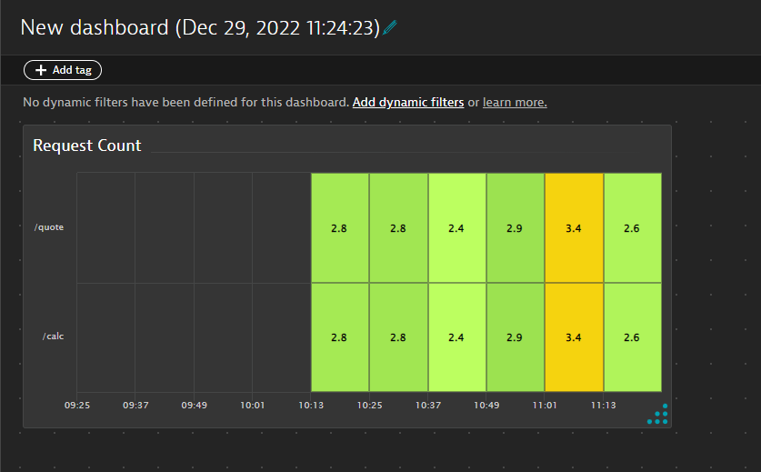
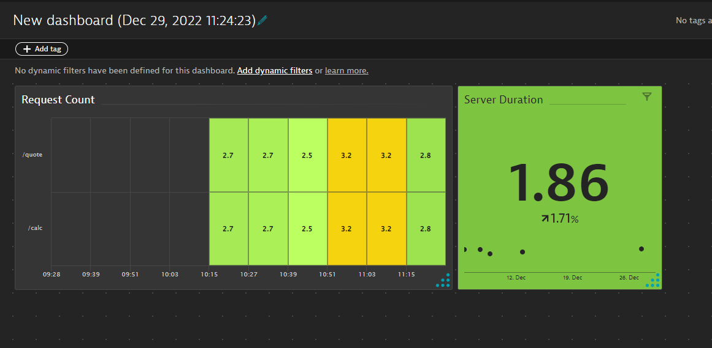
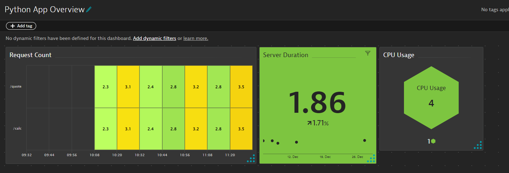

## Metric Browser & Dashboards

Navigate to the metric brower and search for the text `perform.opentelemetry`. Expand `perform.opentelemetry.hot.requests_count` and click `Create chart` to open the data explorer

Let's create a heatmap with the following settings:
1. Split by Dimension `request`
1. Show legend `off`
1. Show Labels `on`
1. Rename our metric to `CPU Usage`
1. Y axis: `Split by Dimensions`
1. Set the threshold as:
- Green > 0
- Yellow > 3
- Red > 5
4. Pin it to a new dashboard with the title `Request Count`

## Task: Add a Single Value tile to the new dashboard

1. Select the `perform.opentelemetry.hot.http.server_duration` metric
1. Choose `Single value` as the chart type
1. Set your thresholds as:
* Green > 0
* Yellow > 2
* Red > 3 
4. Pin to the same dashboard with the title `Server Duration`

Bonus Tasks

    
Bonus Tasks

Add another tile, a Honeycomb, with the metric `perform.opentelemetry.hot.cpu_usage` showing the label and setting Green/Yellow/Red thresholds. Rename the metric to `CPU Usage` and pin this to the dashboard with the title `CPU Usage` and rename the dashboard to Python App Overview. 

Your dashboard should look similar to this:

