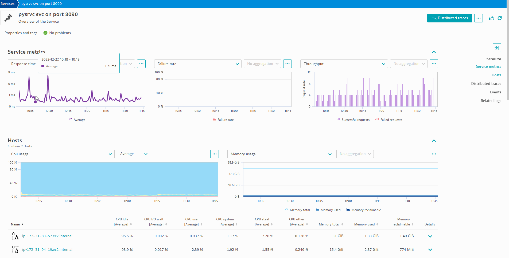

## Creating alerts in Dynatrace

Here we look at ad-hock anlysis of metrics connected to our python service and creating alerts on our metrics. 

1. Trigger Davis Exploritory Analysis
1. Create alerts using auto-adaptive and seasonal baselines 

---

## Davis Exploritory Analysis

#### 📌 Task

Quickly identify observability signals relevant to any signal behavior (for example, a spike on a chart) that you want to investigate. 

1. Navigate into your `order-api` service
1. Highlight the `Failure Rate` timeseries in the unified anlysis screen until the  `analyze` drop down is clickable then select `Failure rate`.

This triggers the Davis causal correlation anlysis to quickly find and explore time series with similar behavior to the one you're investigating.

> 📝 **Best Practice Tips**: 
>- Every data analysis relies on the quality of your data. The quality of the results significantly improves when you select a phenomenon correctly.
>- Causal correlation analysis requires that portions of normal behavior in a reference time series be selected–both before and after any phenomenon under analysis. For a spike analysis, a rule of thumb is that the spike itself should cover a third of the reference time series, with one third before and one third after the spike.

---

## Metric Events (Alerting)

#### 📌 Task

Lets create an Auto Adaptive baseline metric event for the `shop.database.connections.active` metric. 

Navigate to `Settings` > `Anomoly detection` > `Metric Events` > `Add Metric Event`

Set the following:

| Field | Value |
| ------ | ------------- |
| Summary | `Shop: Connections Active`  |
| Type | `Metric Selector` |
| Metric selector | `shop.database.connections.active:splitBy():sort(value(auto,descending)):limit(20)` |

Set the following in the `Monitoring strategy` section:

| Field | Value |
| ------ | ------------- |
| Model Type | `Static threshold`  |
| Number of signal fluctuations | `28` |
| Alert condition | `Alert if metric is above` | 

Then in Alert Preview:

| Field | Value |
| ------ | ------------- |
| Dimension values | `Dimensionless metric`  |

This should trigger a preview based on past data where alerts would have triggered with your current settings.

If you find it too sensitive play with the settings labeled `Advanced model properties` to adjust the alerting, dealerting, and sample period.  Here is a good visualization of how this works:

In the `Alert preview` select `Service=pysrvc svc on port 8090` as the Dimension Value to get the alert preview:

